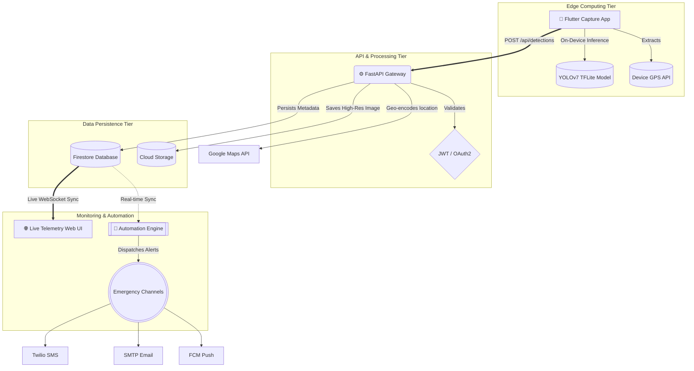

<div align="center">
  
  <h1>🔥 Agniveer — Wildfire Detection System</h1>
  <p>
    <strong>Enterprise-Grade Real-Time Wildfire Detection and Emergency Platform</strong>
  </p>
  <p>
    
    
    
    
    
  </p>
</div>

<br />

> **Agniveer** is a mission-critical, full-stack platform engineered to detect and mitigate wildfires in real-time. By leveraging **Edge-AI (TFLite)** on mobile endpoints, the system eliminates network inference latency and guarantees immediate fire spotting even in remote areas.

---

## 🏗️ System Architecture

Agniveer is built upon a distributed microservices architecture designed for low latency and high availability.



### 🔹 1. Edge Computing Tier
Instead of uploading video feeds and choking bandwidth, Agniveer brings machine learning to the edge. The Flutter app handles on-device inference using TFLite. Only positive detection frames are payloaded to the server to optimize cellular data usage.

### 🔹 2. API Gateway & Processing Tier
Powered by **FastAPI** running atop `uvicorn`, the backend acts as an asynchronous I/O traffic controller. It rapidly ingests image data, decodes spatial coordinates, and reverse-geocodes incidents via the Google Maps API.

### 🔹 3. Data Persistence Tier
- **Firestore:** Manages unstructured fast-moving data with instantaneous cross-client synchronization.
- **Supabase/Cloud Storage:** High-resolution evidentiary images are piped into optimized object storage.

### 🔹 4. Event-Driven Automation Engine
When a detection is verified, it triggers our automation engine. This detaches the notification logic from the REST API, ensuring complex multi-channel retries across SMS, Email, and Push notifications.

---

## ✨ Key Features

- **📱 Offline-First AI Detection**: TFLite on-device inference for zero-latency fire spotting in low-signal areas.
- **📍 Real-Time Geocoding**: Automatically tags exact latitudes/longitudes and reverse maps the closest fire authorities.
- **✉️ Redundant Alert Orchestration**: Parallel SMS (Twilio), Email (SMTP), and Push (FCM) notifications.
- **🌐 Geospatial Dashboard**: Complete Leaflet-based map featuring real-time Firebase listeners and charting.
- **🔐 Enterprise Auth Security**: Role-Based Access Control (RBAC) driven by secure JWT verification.
- **🐳 Docker Support**: Unified `docker-compose` topology for rapid deployment across all components.

---

## 📂 Project Layout

```text
Project_Fire/
├── automation/                 # n8n workflows & setup documentation
├── backend/                    # Python FastAPI API & business logic
├── config/                     # Environment configuration & templates
├── database/                   # Firestore rules & indexing schemas
├── docker/                     # Container orchestration & profiles
├── frontend_website/           # Real-time surveillance dashboard
├── mobile_app/                 # Flutter mobile application codebase
└── scripts/                    # Utility scripts for maintenance
```

---

## 🚀 Getting Started

### 1. Docker Installation (Recommended)

The platform provides a unified container stack for quick deployment.

```bash
# Clone the repository
git clone https://github.com/vinaykumarbharwal/Fire_GITHUB.git
cd Fire_GITHUB

# Build and start services
cd Project_Fire/docker
docker-compose up --build -d
```
> **Services:**
> - Dashboard: `http://localhost:80`
> - API Swagger: `http://localhost:8000/api/docs`

---

### 2. Manual Component Setup

#### **A. Backend Setup**
```bash
cd Project_Fire/backend
python -m venv env_fire
source env_fire/bin/activate  # On Windows: .\env_fire\Scripts\activate
pip install -r requirements.txt
uvicorn api.main:app --reload
```

#### **B. Frontend Website**
```bash
cd Project_Fire/frontend_website
# Open index.html or serve using:
python -m http.server 3000
```

#### **C. Flutter App**
```bash
cd Project_Fire/mobile_app/flutter_app
flutter pub get
flutter run
```

---

## 🔒 Environment Configuration

Duplicate `Project_Fire/config/.env.example` into `Project_Fire/backend/.env`.

| Variable | Description |
| :--- | :--- |
| `FIREBASE_PROJECT_ID` | Your linked Google Cloud overarching Project ID. |
| `SUPABASE_URL` | Your Supabase infrastructure cluster URL. |
| `TWILIO_ACCOUNT_SID` | Core routing SID requirement for n8n SMS dispatches. |
| `JWT_SECRET_KEY` | Encryption signature base for HS256 tokens. |
| `GOOGLE_MAPS_API_KEY` | Binds the Reverse Geocoding services. |

---

## 🔍 Troubleshooting

- **Server Crash on Boot**: Check if `firebase-credentials.json` is missing or if `.env` variables are improperly set.
- **Workflow Pauses**: Check n8n execution logs for network connectivity issues or expired API keys.
- **Mobile Connection**: Ensure the mobile device is on the same network or has the correct `API_URL` configured in `constants.dart`.

---
*Architected and Designed for Public Safety & Real-Time Security.*
