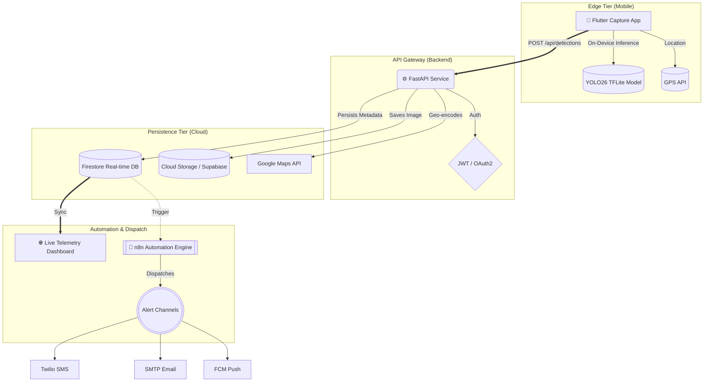

<div align="center">
  
  <h1>🔥 Agniveer — Wildfire Detection System</h1>
  <p>
    <strong>A Sovereign, Enterprise-Grade Real-Time Wildfire Detection and Emergency Response Platform</strong>
  </p>

  <p>
    <a href="https://www.python.org/"></a>
    <a href="https://fastapi.tiangolo.com/"></a>
    <a href="https://flutter.dev/"></a>
    <a href="https://firebase.google.com/"></a>
    <a href="https://www.docker.com/"></a>
  </p>
</div>

<br />

## 📖 Overview

**Agniveer** is a mission-critical, full-stack platform engineered to detect and mitigate wildfires in real-time. By leveraging **Edge-AI (YOLO26 TFLite)** on mobile endpoints, the system eliminates network inference latency and guarantees immediate fire spotting even in remote, low-bandwidth areas.

> [!IMPORTANT]
> This system is designed for public safety and emergency response. It combines edge computing with cloud orchestration to provide a sub-second response loop between detection and alert.

---

## 📑 Table of Contents
- [🏗️ System Architecture](#️-system-architecture)
- [✨ Key Features](#-key-features)
- [📂 Project Layout](#-project-layout)
- [🚀 Quick Start](#-quick-start)
- [🔒 Configuration](#-configuration)
- [🔍 Troubleshooting](#-troubleshooting)
- [🛡️ Security](#️-security)

---

## 🏗️ System Architecture

Agniveer is built upon a distributed microservices architecture designed for low latency and high availability.



### 🔹 1. Edge Computing Tier
Instead of uploading high-bandwidth video feeds, Agniveer brings machine learning to the edge. The Flutter app handles on-device inference using TFLite. Only positive detection frames are payloaded to the server to optimize cellular data usage.

### 🔹 2. API Gateway & Processing Tier
Powered by **FastAPI** running atop `uvicorn`, the backend acts as an asynchronous I/O traffic controller. It rapidly ingests image data, decodes spatial coordinates, and reverse-geocodes incidents via the Google Maps API.

### 🔹 3. Data Persistence Tier
- **Firestore:** Manages unstructured fast-moving data with instantaneous cross-client synchronization.
- **Supabase/Cloud Storage:** High-resolution evidentiary images are piped into optimized object storage.

### 🔹 4. Event-Driven Automation Engine
When a detection is verified, it triggers an automation engine (n8n). This detaches notification logic from the REST API, ensuring complex multi-channel retries across SMS, Email, and Push notifications without slowing down the core API.

---

## ✨ Key Features

- **📱 Offline-First AI Detection**: YOLOv7 TFLite on-device inference for zero-latency fire spotting.
- **📍 Real-Time Geocoding**: Automatically tags exact latitudes/longitudes and reverse maps the closest fire authorities.
- **✉️ Redundant Alert Orchestration**: Parallel SMS (Twilio), Email (SMTP), and Push (FCM) notifications.
- **🌐 Geospatial Dashboard**: Live surveillance dashboard featuring real-time Firebase listeners and interactive mapping.
- **🔐 Enterprise Auth Security**: Role-Based Access Control (RBAC) driven by secure JWT verification.
- **🐳 Dockerized Topology**: Unified `docker-compose` for rapid, one-command deployment.

---

## 📂 Project Layout

```text
Project_Fire/
├── automation/                 # n8n workflows & automation setup
├── backend/                    # FastAPI source code & business logic
│   └── api/                    # Core API implementation
├── frontend/                   # Real-time Web surveillance dashboard
│   └── legacy_v1/              # Legacy version of the dashboard
├── mobile_app/                 # Flutter mobile application
│   └── flutter_app/            # Main Flutter project
└── scripts/                    # Maintenance & utility scripts
```

---

## 🚀 Quick Start

### 1. Unified Setup

The platform is designed to run with a FastAPI backend and a Flutter mobile client.

> [!TIP]
> **Default Access Points:**
> - API Documentation: `http://localhost:8000/api/docs`
> - Legacy Dashboard: Open `Project_Fire/frontend/legacy_v1/index.html` in a browser.

---

### 2. Manual Setup

#### **A. Backend Setup**
```bash
cd Project_Fire/backend
python -m venv env_fire
source env_fire/bin/activate  # Windows: .\env_fire\Scripts\activate
pip install -r requirements.txt
uvicorn api.main:app --reload
```

#### **B. Frontend Website**
```bash
cd Project_Fire/frontend/legacy_v1
# Serve using any static server, e.g., Python:
python -m http.server 3000
```

#### **C. Flutter App**
```bash
cd Project_Fire/mobile_app/flutter_app
flutter pub get
flutter run
```

---

## 🔒 Configuration

Configure the environment variables in `Project_Fire/backend/.env`. A template is provided within that file.

| Variable | Description |
| :--- | :--- |
| `FIREBASE_PROJECT_ID` | Your Google Cloud Project ID. |
| `SUPABASE_URL` | Your Supabase infrastructure URL. |
| `TWILIO_ACCOUNT_SID` | Twilio SID for SMS notifications. |
| `JWT_SECRET_KEY` | Secret key for JWT signing. |
| `GOOGLE_MAPS_API_KEY` | Key for Geocoding services. |

---

## 🔍 Troubleshooting this side

- **Server Connection Errors**: Verify `firebase-credentials.json` is present in the `backend/` root.
- **Mobile Sync Issues**: Ensure the mobile device can reach the server IP (updated in `constants.dart`).
- **Dashboard Data Lag**: Check if the Firestore security rules allow read access from the dashboard domain.

---

<div align="center">
  <p><i>Architected and Designed for Public Safety & Real-Time Security.</i></p>
  
</div>
