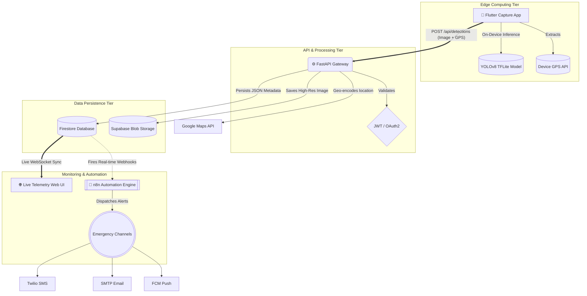

<div align="center">
  <h1>🔥 Agniveer — Wildfire Detection & Surveillance System</h1>
  <p>
    <strong>Enterprise-Grade Real-Time Wildfire Detection and Emergency Automation Platform</strong>
  </p>
  <p>
    
    
    
    
    
  </p>
</div>

<br />

Agniveer is a mission-critical, full-stack platform engineered to detect and mitigate wildfires in real-time. By leveraging Edge-AI (TFLite) on mobile endpoints, the system eliminates network inference latency. Detected telemetry is efficiently routed through a highly concurrent FastAPI backend, persisted in Google Firestore, and seamlessly broadcasted to a live geospatial dashboard. High-confidence alerts automatically trigger a localized, multi-channel automated emergency response logic via n8n.

---

## 📑 Table of Contents

- [System Architecture](#%EF%B8%8F-system-architecture)
- [Key Features](#-key-features)
- [Tech Stack](#%EF%B8%8F-tech-stack)
- [Project Layout](#-project-layout)
- [Getting Started](#-getting-started)
  - [Docker Installation (Recommended)](#1-docker-installation-recommended)
  - [Manual Installation](#2-manual-installation)
- [Environment Configuration](#-environment-configuration)
- [API Reference](#-api-reference)
- [Troubleshooting](#-troubleshooting)

---

## 🏗️ System Architecture

Agniveer is built upon a modern, distributed microservices-oriented architecture designed for low latency, high availability, and rapid deployment in emergency scenarios. 



### 1. Edge Computing Tier
Instead of uploading video feeds and choking bandwidth, Agniveer brings machine learning to the edge. The Flutter app strictly handles on-device inference using TFLite (YOLOv8 framework). Only high-confidence, positive detection frames are payloaded to the server to heavily optimize cellular data usage in remote forest areas.

### 2. API Gateway & Processing Tier
Powered by **FastAPI** running atop `uvicorn`, the backend acts as an asynchronous I/O traffic controller. It rapidly ingests multipart image data, decodes spatial coordinates, and reverse-geocodes incidents via the Google Maps API to locate the closest physical fire stations. The API is entirely stateless, utilizing stateless JWTs mapped to Firebase Identity strings.

### 3. Data Persistence Tier
We enforce a split-storage logic:
- **Relational / NoSQL Metadata:** Google **Firestore** manages unstructured fast-moving data, allowing instantaneous cross-client synchronization.
- **Blob Object Storage:** High-resolution evidentiary images are seamlessly piped into **Supabase**, utilizing its globally distributed CDN.

### 4. Event-Driven Automation Engine
When a detection is verified or automatically reaches "Critical" severity metrics in Firestore, it triggers our locally-hosted **n8n** automation engine. This detaches the notification logic cleanly from the Rest API layer, ensuring complex multi-channel retries across Twilio (SMS), SMTP Servers, and Firebase Cloud Messaging (FCM) operate asynchronously without blocking the core event loop.

---

## ✨ Key Features

- **📱 Offline-First AI Detection**: TFLite on-device inference guarantees zero latency and immediate fire spotting even in low-bar signal areas.
- **📍 Real-Time Interpolated Geocoding**: Automatically tags exact latitudes/longitudes and reverse maps the closest geographical fire authorities.
- **✉️ Redundant Alert Orchestration**: Parallelly fires SMS (Twilio), Email (SMTP), and Push (FCM) via asynchronous automation graphs.
- **🌐 Geospatial Telemetry Dashboard**: Complete Leaflet-based dynamic map GUI featuring real-time Firebase listeners, statistics, charting, and customizable dark modes. 
- **🔐 Enterprise Auth Security**: Strictly typed Role-Based Access Control (RBAC) driven by secure payload JWT verification.
- **🐳 Scalable Docker Support**: Zero-configuration `docker-compose` topology spins up the Backend API, the Reverse Proxied Frontend, and the automation container dynamically.

---

## 🛠️ Tech Stack

| Domain | Primary Technology | Supporting Frameworks |
| :--- | :--- | :--- |
| **Mobile Client** | Flutter / Dart | TFLite, `camera` package |
| **API Backend** | Python 3.11 / FastAPI | Uvicorn, Pydantic, Passlib, PyJWT |
| **Realtime Datastore** | Google Cloud Firestore | Firebase Admin Python SDK |
| **Asset Storage** | Supabase Storage | `supabase-py` native client |
| **Frontend Surveillance** | Vanilla JS / HTML5 | TailwindCSS, Leaflet.js, Chart.js 4.0 |
| **Event Automation**| n8n (Node Automation) | Twilio API, SMTP Transports |
| **DevOps & Infusion** | Docker | Nginx, Docker Compose |

---

## 📂 Project Layout

```text
Project_Fire/
├── automation/                 # Extracted stateless n8n workflows (JSON)
├── backend/                    # Python API Microservice
│   ├── api/                    # Core Domain / Routes / Schemas
│   ├── .env                    # System Environment Credentials
│   └── requirements.txt        # Locked Dependency Tree
├── config/                     # Global Variable Bootstrap templates
├── database/                   # Upstream Firebase Rules & Schemas
├── docker/                     # Unified Container orchestration profiles
├── frontend_website/           # Real-time WebSocket SPA interface
└── mobile_app/flutter_app/     # Native Android / iOS Application
```

---

## 🚀 Getting Started

### 1. Docker Installation (Recommended)

The platform provides a highly coupled container orchestration file to completely emulate production infrastructure on your local machine.

```bash
# Clone the repository
git clone https://github.com/vinaykumarbharwal/Project_Fire.git
cd Project_Fire

# Bootstrap environment variables (Edit this file with your keys)
cp config/.env.example backend/.env

# Build and start the ephemeral network stack
cd docker
docker-compose up --build -d
```
> **Services Running at:**
> - Web Surveillance Map: `http://localhost:80`
> - API & Swagger Docs: `http://localhost:8000/api/docs`
> - Automation Engine (n8n): `http://localhost:5678`

---

### 2. Manual Installation

For bare-metal debugging, you can modularly instantiate the services.

#### **A. Backend Setup**
Navigate to the backend, allocate a clean virtual environment, and boot Uvicorn.
```bash
cd backend
python -m venv env_fire
source env_fire/bin/activate  # On Windows: .\env_fire\Scripts\activate
pip install -r requirements.txt
uvicorn api.main:app --host 0.0.0.0 --port 8000 --reload
```

#### **B. Frontend Website**
Serve the lightweight frontend site locally to sidestep CORS.
```bash
cd frontend_website
python -m http.server 3000
# Dashboard horizontally scales and connects to Firebase automatically
```

#### **C. Flutter App Compilation**
Run the mobile application entry point through the Flutter framework.
```bash
cd mobile_app/flutter_app
flutter pub get
flutter run
```
> **Note:** Drop your proprietary YOLO/TFLite tensors directly into `assets/models/your_trained_model.tflite`.

---

## 🔒 Environment Configuration

Duplicate `config/.env.example` into `backend/.env`. Missing variables will prevent the Uvicorn runtime from initializing correctly.

| Variable | Description |
| :--- | :--- |
| `FIREBASE_CREDENTIALS` | Reference path to your downloaded `firebase-credentials.json` file. |
| `FIREBASE_PROJECT_ID` | Your linked Google Cloud overarching Project ID. |
| `SUPABASE_URL` | Your Supabase infrastructure cluster URL. |
| `SUPABASE_ANON_KEY` | Scoped public access key strictly assigned to the `detections` bucket. |
| `TWILIO_ACCOUNT_SID` | Core routing SID requirement for n8n SMS dispatches. |
| `JWT_SECRET_KEY` | Length-verified encryption signature base for HS256 tokens. |
| `GOOGLE_MAPS_API_KEY` | Binds the Reverse Geocoding and geometric intersection services. |

---

## 📡 Core API Reference

The backend dynamically mounts an interactive Swagger UI blueprint (`/api/docs`). Below are the primary transaction arteries:

| Endpoint | Method | Secured | Function |
| :--- | :---: | :---: | :--- |
| `/api/auth/register` | `POST` | ❌ | Allocates a new application user footprint. |
| `/api/auth/token` | `POST` | ❌ | Marshals credentials and negotiates an active JWT. |
| `/api/detections/report` | `POST` | ✅ | Primary ingest node. Processes image multipart and GPS data. |
| `/api/detections/active`| `GET` | ❌ | Rapid-retrieval stream of currently verified burning anomalies. |
| `/api/detections/{id}`| `PUT` | ✅ | Dispatches a patch object to override severity and automated tracking modes. |
| `/api/notifications/` | `GET` | ✅ | Pulls a chronologically sorted history of broadcasted push signals. |

---

## 🔍 Troubleshooting

- **Server Crash on Boot**: The most frequent failure is missing/misconfigured Service Account Keys. Ensure `backend/firebase-credentials.json` accurately mirrors what `FIREBASE_CREDENTIALS` expects.
- **Dangling Firestore Connections**: Review Firestore Data Rules injected from `database/firebase/`. Explicit `Auth=null` blocks will reject the app frontend.
- **Object Storage Refusal**: Make absolutely sure your assigned `SUPABASE_BUCKET_NAME` targets a pre-allocated public bucket inside Supabase dashboard.
- **Workflow Pauses**: If the automated SMS or SMS streams freeze, navigate to n8n (`:5678`), check execution logs visually, and confirm your persistent keys inside `N8N_PERMANENT_SETUP.md` are bound.

---
*Architected and Designed for Public Safety & Real-Time Security.*
